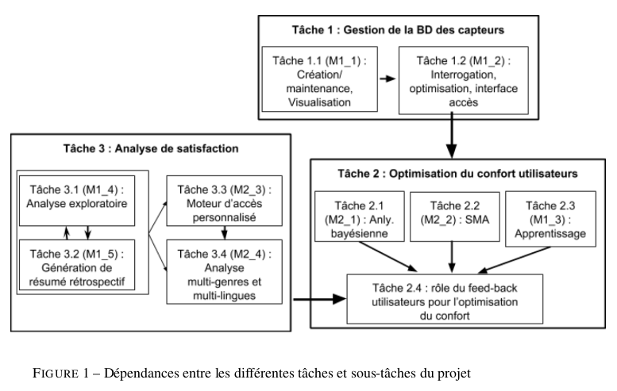

# Documentation

## Projet Interpromo (neOCampus)

 - [Vue générale du projet](neocampus/projectDescription-1.pdf)
 - Détail des taches :
    - [Tache 1](neocampus/tache1-BD.pdf)
    - [Tache 2](neocampus/tache2-optimisation.pdf)
    - [Tache 3](neocampus/tache3-satisfaction.pdf)
   

---

## Gestion de projet

 - [Quelques repèrs en gestion de projet](UEprojet/quelques_reperes.pdf)
 - La [Mind-map](UEprojet/LeDeveloppementLogicielDansSonEnsemble.pdf)
 - Travail attendu en TD et barèmes d'évaluation : [diaporama "Organisation"](UEprojet/Organisation_2018_2019.pdf) (pages 16 et +)

