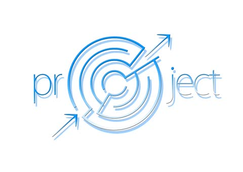

# Plan de Management de Projet - Initial

  
*Pré-version 0.ß en date du 11/01/01 (juste après le premier TD)*

### Table des matières

 - [Qualité](#paql-qualité)
 - [Parties prenantes](#pm-parties-prenantes)
 - [Contenu](#pm-contenu)
 - [Communication](#pm-communication)
 - [Délais](#pm-échéancier)
 - [Risques](#pm-risques)
 - [Coûts](#pm-coûts)
 - [Ressources humaines](#pm-ressources-humaines)
 - [Approvisionnements](#pm-approvisionnements)

---

## PAQL (Qualité)

 - Qualité modélisation (UML)
 - Qualité du code
   - Convention de code : variablesDeCetteForme. 
   - Correction : produit les résultats demandés -> tests ?
 - Pertinence des résultats
   - Établir la/les métrique(s) permettant d'évaluer la pertinence des résultats
   - Tests de pertinence : façon validation croisée ?

---

## PM Parties Prenantes

#### Côté client (MOA)

 - PELLEGRINI Thomas + contact
 - BENAMARA Farah + contact
 - ?

#### Côté collaborateurs

 - Groupe ? : tâche i.j
 - ?

#### De notre côté

 - HUTEAU Jeremie: responsabilités: Cap'taine de projet
 - MARTY Quentin -- responsabilités: doc
 - POMERET-COQUOT Pierre -- responsabilités: délais, RH

Répartition des responsabilités :

|                | HUTEAU J. | MARTY Q. | POMERET-COQUOT P. |
| :------------- | :-------: | :------: | :---------------: |
| Chef de projet | X         |          |                   |
| Documentation  |           | X        |                   |
| Délais         |           |          | X                 |
| RH             |           |          | X                 |

et puis...

---

## PM Contenu

 - Exigences: récupérées auprès de T.PELLEGRINI + groupes i.j + ?
 - Données:
   - Quand ? 
   - Consommation energétique ?
 
---

## PM Communication

Communication avec T.PELLEGRINI: le lundi matin toutes les deux semaines ?
A confirmer lundi prochain

---

##  PM Échéancier

| Semaine | # iter | lundi | UPS        | Projet         |
| :-----: | :----: | :---- | :--------- | :------------- |
| 50      |        | 10/12 | Examens    |                |
| 51      | 0      | 17/12 |            |                |
| 52      |        | 24/12 | Vacances   |                |
| 1       |        | 31/12 | Vacances   |                |
| 2       |        | 07/01 |            |                |
| 3       | 1      | 14/01 |            | RDV Pellegrini |
| 4       |        | 21/01 |            |                |
| 5       | 2      | 28/01 |            |                |
| 6       |        | 04/02 |            |                |
| 7       | 3      | 11/02 |            |                |
| 8       |        | 18/02 |            |                |
| 9       |        | 25/02 | Vacances   |                |
| 10      | 4      | 04/03 |            |                |
| 11      |        | 11/03 |            |                |
| 12      | 5      | 18/03 |            |                |
| 13      |        | 25/03 |            |                |
| 14      | 6      | 01/04 |            |                |
| 15      |        | 08/04 |            |                |
| 16      | FIN    | 15/04 |            | Soutenance     |
| 17      |        | 22/04 | Vacances   |                |
| 18      |        | 29/04 |            |                |
| 19      |        | 29/04 |            |                |
| 20      |        | 29/04 | Examens    |                |

---

## PM Risques

| Risque                   | Gravité | Probabilité | Solution apportée |
| ------------------------ | :-----: | :---------: | ----------------- |
| Catastrophe naturelle    | +++     | ---         | N/A               |
| Catastrophe surnaturelle | +++     | ---         | N/A               |
| Flemme                   | +       | +-          | Menace puis sanction puis mort |
| Abandon / mort           | +++     | -           | Remplacement      |

---

## PM Coûts

Inutile parce que ...

---

## PM Ressources Humaines

---

## PM Approvisionnements

