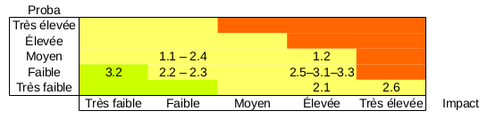

# Plan de Management de Projet initial

Dans le cadre de l'UE Projet du M1 Informatique de l'université Paul Sabatier, nous nous sommes engagés à mener à bien un projet proposé par l'équipe pédagogique de la filière DC.
Ce document présente notre plan de gestion, c'est à dire les processus et informations que nous utiliserons pour mener à bien le projet.

- [Introduction](#introduction)
- [Contenu](#pm-contenu)
- [Délais](#pm-délais)
- [Coûts](#pm-coûts)
- [Qualité](#pm-qualité)
- [Ressources Humaines](#pm-ressources-humaines)
- [Communications](#pm-communications)
- [Risques](#pm-risques)
- [Approvisionnements](#pm-approvisionnements)
- [Parties Prenantes](#pm-parties-prenantes)

---

## Introduction

### Charte du projet
Le document de présentation du projet (http://departement-informatique.univ-tlse3.fr/master-dc/wp-content/uploads/sites/2/2018/12/tache2-optimisation-1.pdf : tâche 2.3) fait office de charte du projet.

### Méthodologie générale

La méthode de gestion de projet appliquée (inspirée d'OpenUP) définit 2 axes :
  - 10 domaines de connaissances
  - 5 types de processus
A l'intersection de chaque type de processus avec chaque domaine, on trouvera (ou non) une (ou plusieurs) activités, qui correspondent à une tâche essentielle de la gestion de projet.

Afin d'améliorer la flexibilité de la gestion, le projet est découpé en n itérations (durée fixe : 2 semaines). Celles-ci amènent à la production d'un livrable, ce qui permet au client de préciser/modifier ses exigences et à l'équipe de mieux les comprendre. Les itérations débutent par une planification et finissent par une rétrospective, afin de permettre l'amélioration du fonctionnement de l'équipe d'une itération sur l'autre.

Le chef de projet est chargé de coordiner les activités de gestion, mais ne dispose pas d'une autorité supérieure aux autres membres.

#### Processus
Les processus se distinguent en 5 catégories. Nous en faisons une description sommaire (tiré du cours de l'UE) qui permet de se faire une idée globale du déroulement d'un projet.

Démarrage :
  - Décrire les motivations du projet ou de la phase
  - Définir les objectifs du projet ou de la phase
  - Définir préliminairement le contenu du projet ou de la phase

Planification :
  - Etablir le contenu total de l'effort
  - Définir et affiner les objectifs
  - Développer la suite d'actions nécessaires pour atteindre les objectifs

Exécution :
  - Accomplir le travail défini dans le PMP :
    - Coordiner les personnes et ressources
    - Manager les attentes des PP
    - Intégrer et conduire les activités décrites dans le PMP

Surveillance & Maîtrise :
  - Suivre, revoir, constater l'avancement et la performance du projet
  - Identifier les parties pour lesquelles des modifications du plan sont nécessaires

Clotûre :
  - Finaliser les activités, formaliser la fin de phase/projet/obligations contractuelles

---

## PM Contenu

*S'assurer que tous le travail requis, et seulement le travail requis, est réalisé.*

Plusieurs aspects, plusieurs produits :

1. Documents de TD (=SJQ)
2. Comptes-rendus M. Pellegrini
3. Diaporama de soutenance
4. Fiches d'avancement Interpromo

*ordonné selon le barème de notation*

### Définition du contenu

TD :

1. Les produits sont identifiés et listés en séance
2. Cette liste est validée par Mme Oliveira avant la fin de la séance
3. Le contenu est défini

Compte-rendus M. Pellegrini :

1. Les produits sont identifiés en RDV
2. Ils sont listés dans le compte-rendu de RDV (chapitre à part)
3. Le compte-rendu est envoyé par mél à M. Pellegrini
4. M. Pellegrini confirme
5. Le contenu est défini

Diaporama de soutenance :

- **Le protocole n'est pas élabli**

Fiches d'avancement Interpromo

- **Le protocole n'est pas élabli**

### Réalisation du contenu

Pour chaque produit liste (TD, compte-rendu de rendez-vous) :

1. Les taches sont estimées en *points d'effort*
2. L'ordonnancment est décidé pour la réalisation de ces produits (voir PM délais : ordonnancement + échéance)
3. On attribue à chaque tache un *réalisateur* selon les *points d'effort* attribués
4. On attribue à chaque tache un *référent* différent du *réalisateur*. Il aide et contrôle.
5. Une branche dédiée est créée sur le dépôt git. La liste des produits (1.) y est déposée
6. Les produits y sont déposés au fur et à mesure de leure réalisation
7. Après validation, la branche est fusionnée avec *master* afin d'en faciliter l'accès à Mme Oliveira

### Validation du contenu :

1. L'auteur/l'un des auteurs crée une carte sur le *Trello* (colonne *Validation*)
2. Le *référent* compare le produit à celui identifié et listé en TD (protocole 1.)
3. Les remarques / réserves / objections / suggestions sont ajoutées en commentaire à la carte sur le *Trello*. Si besoin, une réunion peut être organisée.
4. La validation est actée. La carte reste sur le *Trello* jusqu'à ce que la branche ait été fusionnée

### Recueil des exigences

TD / SJQ

1. Les livrables sont déposés sur un dépôt *git* ou *Google drive* dont l'accès est partagé avec Mme Oliveira
2. Les échéances sont respectées, **la date du dépôt faisant foi**.
3. D'après le barème incomplet ([Organisation 2018-2019, pages 22 à 27](../documentation/UEprojet/Organisation_2018_2018.pdf))
   - Compte-rendu pour chaque RDV, communiqué suffisament à l'avance pour être corrigé à la réunion suivante
   - Livrables conformes aux attentes
   - Support / diaporama lors de la recette (*apporte une réelle plus-value*)
   - Aucun livrable ne manque

M. Pellegrini

- Langage *python*
- Bibliothèques *keras* (recommandée) et *scikit*
- Les comptes-rendus sont au format notebook/jupyter

Diaporama de soutenance

- Première page :
   - Nom et composition de l'équipe
   - Nom du client
   - Organisme du client
   - Titre du projet
   - Date
   - Logos si utiles
 - Adapté à 12-15 minutes
 - Une diapositive donne le plan, les suivantes permettent de suivre l'avancement dans ce plan
 - Pas de fautes d'orthographes
 - Transparent avec points positifs et négatifs
 - Sujet du diaporama : guidé par le barème [Organisation 2018-2019, pages 26](../documentation/UEprojet/Organisation_2018_2018.pdf)

Fiches d'avancement Interpromo

- Toutes les semaines
- Document sur *Google Drive* de l'UE **lien ?**
- Par le *chef de projet*

Format :

- Les documents sont rédigés en *MarkDown*
- Les images sont placées dans un dossier *images/*

### Stockage du contenu

| Produit                       | Workspace | Final        | Sauvegarde |
| :---------------------------- | :---------| :----------- | :--------- |
| Livrables TD                  | Dépôt git | Dépôt git    |            |
| Livrables M. Pellegrini       | Dépôt git | *aucun*      |            |
| Diaporama de soutenance       | Dépôt git | *aucun*      |            |
| Fiche d'avancement Interpromo | *aucun*   | Google Drive |            |

### SDP

http://yuml.me/edit/b0351123

Le sous-découpage et l'évaluation des tâches en points d'effort sera effectuée
lors des réunions d'ouverture d'itération.

---

## PM Délais

*S'assurer que les taches sont réalisées dans le bon ordre, et terminée à temps*

### Définition des échéances

1. Identification des dépendances temporelles (tâche A dépend de tâche B qui dépend de tâche C...)
2. Identification de l'échéance générale
  - Livrables : les échéances sont imposées
  - Produits internes / intermédiaires : les échéances sont estimées en réunion (planning poker, cf. contenu)
3. Échéance supérieure à une semaine -> découpage en sous-tâches, et *goto 1*
4. Les tâches et échéances sont ajoutées au diagramme de Gantt.

*Non confirmé : les principales échéances sont reportées sur un calendrier indiquant les périodes de vacances, examens, etc. de l'UPS.*

### Contrôle et maîtrise des échéances

Le diagramme de Gantt (et l'échéancier) sont consultables à tout moment sur le dépôt git.

Chaque *réalisateur* est responsable, avec son *référent* de la tenue des délais (cf PM Contenu).  
S'il craint de ne pas honorer l'échéance, il demande de l'aide (à sa propre initiative)  
Le référent doit remarquer (entre autres) les retards éventuels... avant qu'ils ne se produisent (c'est plus facile avec un œil extérieur).

Le découpage des tâches en tâches élémentaires (max 1 semaine) permet de suivre l'avancement lors de TD (vendredis) et des réunions d'itérations (lundis).  
Cela est suffisant pour réduire le risque de retard, et pour permettre de s'en rendre compte rapidement.

### Recueil des exigences

TD / SJQ

- Les échéances des livrables sont respectées, **la date du dépôt (git) faisant foi**.

M. Pellegrini

- **à définir**

Soutenance

- **à définir**

Fiches d'avancement Interpromo

- Toutes les semaines

### Diagramme de Gantt

### Calendrier UPS / Projet

| Semaine | # iter | lundi | UPS                                   | Projet         |
| :-----: | :----: | :---- | :------------------------------------ | :------------- |
| 50      |        | 10/12 | **Examens**                           |                |
| 51      | -1     | 17/12 |                                       | Initiation     |
| 52      |        | 24/12 | *Vacances*                            |                |
| 1       |        | 31/12 | *Vacances*                            |                |
| 2       |        | 07/01 |                                       |                |
| 3       | 0      | 14/01 |                                       | Organisation   |
| 4       |        | 21/01 |                                       |                |
| 5       |        | 28/01 |                                       |                |
| 6       | 1      | 04/02 |                                       | Exécution      |
| 7       |        | 11/02 |                                       |                |
| 8       | 2      | 18/02 |                                       |                |
| 9       |        | 25/02 | *Vacances*                            |                |
| 10      | 3      | 04/03 |                                       |                |
| 11      |        | 11/03 |                                       |                |
| 12      | 4      | 18/03 | **Exam IDBR**                         |                |
| 13      |        | 25/03 |                                       |                |
| 14      | 5      | 01/04 | **Exam OCA**                          | Clôture        |
| 15      |        | 08/04 | **Exams IAA, TIR**                    | Recette        |
| 16      | FIN    | 15/04 | **Exams AIRCR, TAAAS, CESGBDR, Prof** | Soutenance     |
| 17      |        | 22/04 | *Vacances*                            |                |
| 18      |        | 29/04 | *Vacances* ...                        |                |

---

## PM Coûts

Aucun coût de quelque nature que ce soit ne nous est apparent, ce qui rend ce domaine de connaissances non-pertinent pour notre projet.

---

## PM Qualité

### Identification des exigences qualité

- En extrayant les exigences directement des PP via des entretiens, le cahier des charges
ou simplement une liste d'exigence décrétée par les PP.
- En se fixant nous-même, entre les membres du projet, des exigences qualités afin d'améliorer le travail en groupe
ou la lisibilité du code.

Exigences qualités d'origine externe (notée de 11 à 19) :
- 11 : Utilisation de Python avec Scikit ou Keras (exigence du MOA)

Exigences qualités d'origine interne, réunions et bonnes pratiques (notée de 21 à 29) :  
* 21 : Les produits, consituant des livrables, devront être partagé et developpé par plusieurs membres de l'équipe avec facilité  
* 22 : Pour s'assurer que tous les membres du groupe ont comprit une tâche -> faire modélisation besoin, faire recondition/postcondition

### Solutions qualité

- 11 : Exigence simple à satisfaire : developper avec python.
- 21 : Convention de code : PEP8 (https://www.python.org/dev/peps/pep-0008/)
- 22 : Utiliser le formalisme du triplet de hoare sur les fonctions.

### Contrôle qualité

L'application de toutes les exigences doit être validée par consensus pour être considérée conforme et fonctionnelle.

### Définition de fini

Une fois qu'une tâche (représentée par une carte Trello) est placée dans la colonne "A valider", elle est sujette à examen par les autres membres du groupe. En l'absence d'opposition forte, une discussion informelle (en personnes) (ou l'expression d'une approbation sur Trello) permet de confirmer la validité de la tâche.
En l'absence de validation une fois l'échéance arrivée, la tâche peut tout de même être "finie" si elle est jugée d'une qualité suffisante ("good enough") mais est néanmoins ajoutée aux tâches de l'itération suivante (pour la finir "pour de vrai").

---

## PM Ressources Humaines

Les membres des diverses Parties Prenantes sont des personnes, et ont par conséquent des rôles, des responsabilités, des compétences. Il est important de les prendre en compte pour mener à bien le projet.
Aucune exigence ne concernant les Ressources Humaines n'a été émise par quelque Partie Prenante que ce soit.

### Protocoles

#### Constitution de l'équipe
Nous n'avons pas le choix de l'équipe, par conséquent aucun protocole n'est défini.

Disponibilités des ressources :
- MOE : totale
- M1-M2 : disponible (probablement pas durant les vacances scolaires), mais peut mettre du temps à répondre (si demande de travail)
- MOA & référents : disponible (probablement pas le w-e), en réunion si planifiée et convéniente

#### Développement de l'équipe
Il est nécessaire d'identifier les compétences nécessaires et non-présentes pour chaque tâche, afin d'être en mesure de pallier le manque. La stratégie d'évolution des compétences n'est pas définie, car dépendante de la compétence à faire progresser (on considérera probablement les ressources pédagogiques de l'UPS, la BU et Internet).

Il est possible que les interractions entre les ressources soient améliorables (mesurées par la performance de l'équipe). Il semble très difficile d'établir un protocole concernant l'évolution des interractions, et ici l'intérêt est faible. On fera surtout attention à ce que certains membres de l'équipe ne s'imposent/s'effacent pas trop fréquemment quand à la prise de décisions.

#### Direction de l'équipe
Afin de pouvoir évaluer l'efficacité des mesures prises et ajuster la direction de l'équipe, il est nécessaire d'avoir une métrique de performance, actuellement non-définie.
La gestion des problèmes divers (dans le cadre du "travail" et qui concernent des RH) est très difficile à définir. Nous avons décidé de tous veiller au maintien d'un bon environnement de travail.

### Rôles
  - Jérémie Huteau, Quentin Marty, Pierre Pomeret-Coquot : MOE
  - Thomas Pellegrini : MOA et enseignant référent
  - Raquel Oliveira : SJQ

### Responsabilités
  - MOE : ~100h de travail chacun
  - Jérémie : Chef de projet

### Compétences
  - Thomas Pellegrini : apprentissage
  - Jérémie, Quentin : bases en apprentissage (Pierre en progrès)
  - Enseignants UPS : apprentissage, mathématiques, traitement de données, etc...

### Matrice RACI

| Domaine | Tâche | MOE | MOA | Référents | SJQ | Groupes Interpromo
| :---: | :---: | :---: | :---: | :---: | :---: | :---: |
| Intégration | | | | | |
| | PMP | R,A | | | C,I | |
| | Charte | R | A | | | |
| | Direction | R,A | | | C | |
| | Maîtrise | R,A | C,I | | C | |
| | Clotûre | R,A | C,I | | | |
| Contenu | | | | | | |
| | Exigences	| R,A	| C,I	| C	| C	| C |
| | SDP	| R,A	| C	| C | I	|	|
| | Recette	| R,A	| C,I	| C | |	|
| | Soutenance | R,A	| | | I |	|
| | Fiches av. IP	| R,A	| | I | |	|
| | Maîtrise | R,A | | | | |
| Délais | | | | | | |
| | Échéances TD	| R	| |	| A,C |	|
| | Échéances R&D	| R	| A,C | | | C	|
| | Maîtrise | R,A | I || I | |
| Qualité | | | | | | |
| | Exigences	| R,A | C | | C | C |
| | Solutions | R,A | | C | C | |
| RH | | | | | | |
| | PM | R,A | | | | |
| | Développement | R,A | | C | | |
| | Direction | R,A | | | | |
| Communications | | | | | | |
| | Exigences | R,A | C,I | C | C | C |
| | Gestion | R,A | | | | |
| Risques | | | | | | |
| | Identification	| R,A | | | C | |
| | Solutions	| R,A | | | C | |
| PPs | | | | | | |
| | Gestion	| R,A | | | | |
| | Maîtrise | R,A | | | C | |

Sachant que le SJQ a accès à tous nos documents de gestion, ils sont automatiquement informé. Les Plans de Management de chaque domaine font partie du PMP, et sont donc R,A pour la MOE.

---

## PM Communications

### Protocoles de communication

#### Gestion des communications (exécution)/ Maîtrise des communications (maîtrise)
Les communications en internes doivent respecter les formats définis ci-après, mais peuvent être initiées sans l'accord du reste de l'équipe, contrairement aux communications externes.

Les réponses aux communications seront communiquées au groupe.

### Exigences des Parties Prenantes et modalités

  - MOE : clarté, réactivité (trello, mail, irl)
    - https://trello.com/b/HIFU6ivc/ue-projet
  - SJQ : accès aux documents de management (drive/git)
    - https://github.com/pPomCo/DC_GroupeA/tree/iter1/management
  - MOA : RAS
    - thomas.pellegrini@irit.fr
  - Enseignants référents
    - F. Benamara : remplissage de la fiche hebdomadaire de suivi (drive)
      - https://docs.google.com/spreadsheets/d/1mXNldjerYVPGoSLtxrQip4bKbGANgVVFuxrIqGd6NQg
  - Groupes M1-M2
    - M. Poquillon & Co : transmission de l'interface à la BD voulue (drive)
      - https://docs.google.com/spreadsheets/d/1mkJSNJf7G1MV1WiDxpdc_UkcILWSN6-FTRYMVg6mxeo
  - Communauté scientifique : mesures des résultats, non-ambiguïté

Certaines exigences présentes ici n'ont peut-être pas leur place dans ce domaine (elles concernent le contenu des communications), mais elles nous semblent ne pas être hors-sujet ici.

### Formats

#### Documents
Les documents sont rédigés en *Markdown*, les images se trouvent dans le répertoire *images/*.

#### Réunions
Une réunion ne concerne qu'un seul sujet. L'objectif est de mener à bien la discussion (pas nécessairement de consensus s'il semble impossible/trop lointain) en le moins de temps possible (les réunions, c'est pénible).

Découpe des réunions en 5 phases :
  - Avant : définition et communication du sujet de la réunion, recherche des points à aborder, choix d'un modérateur
  - Début : ordonnancement des points à aborder selon un système de points à distribuer
  - Corps : discussion des points et report des conclusions
  - Fin   : agrégat des conclusions et synthèse
  - Après : rédaction du compte-rendu de réunion

Un modérateur (à l'autorité absolue) veille à ce que la réunion soit le plus libre possible de hors-sujets et activités infructeuses en tout genres, et à ce que chaque membre exprime son avis. Si le membre qui subit le courroux du modérateur juge le sujet important, il peut l'ajouter à la liste des sujets potentiels de réunions.

#### Comptes-rendus
Un compte-rendu est rapide et simple à lire. Les listes à puces, bien que peu élégantes, sont préférées. Chaque point doit être décrit sans phrases (sinon on n'est plus concis).

La structure est la suivante :
  - méta-données : horaires, durée
  - sujet
  - points et conclusions
  - remarques

---

# PM Risques

## Identifications des risques / opportunités

### 1. Risques humains :

1. Baisse de productivité d’un membre du groupe liée à une cause personnelle
2. Mauvais recueil des exigences

	Echec ou retard dans la réalisation de certains objectifs d’itération (mal défini)

### 2. Risques externes :

1. Le MOA ne s’implique plus, perd de l'intérêt pour le projet
2. Coopération difficile avec les groupes dont on dépend
3. Perte de productivité des PP (autres M1-M2)
4. Les autres comprennent mal nos exigences
5. Modification des échéances, particulièrement de la soutenance
6. Chute de météorite de dinosaures glacés glacée

### 3. Risques techniques
 
1. Perte de matériel
2. Perte de données
3. Perte du produit

### 4. Risques organisationnels

 - Aucun

### 5. Opportunités :

1. Conseils de la part des M2 et du référent au niveau de la partie R&D

## Conséquence et analyse qualitative des risques

**Matrice de criticité :**

	Ancienne version :

	 - Risque 1.1 : Certains aspects (domaines de connaissance) ne seront plus aussi bien réalisés ce qui va affecter le bon déroulement du projet et l’atteinte des objectifs
	 - Risque 1.2 : Preuve de mauvaise gestion du projet, peut entraîner des surcoûts de management supplémentaire (concession de certaines partie du projet jugées moins importantes)
	 - Risque 1.3 : Perte de temps, coût de remanagement des délais
	 - Risque 2.1 : Risque d’incompréhension des attentes du MOA, réalisation des besoins plus difficile
	 - Risque 2.2 : Mise à l'échelle impossible
	 - Risque 3.1 : Gain de temps en R&D

	https://zupimages.net/up/19/05/jeqn.png

Ordre de priorité des risques : 31, 12, 13, 21, 11, 22

## Stratégies de gestion des risques

La stratégie adoptée pour les risques dont la criticité estimée (cf matrice) est strictement sous la diagonale est   “l’acceptation”, c’est à dire traiter le risque seulement s’il se produit puisque concevoir une solution pour chaque  
risques de faible impact et faible probabilité est un surcoût de management trop important et ne laisse pas de flexibilité managériale.  
Dans le cas inverse, l’objectif est l'atténuation du risque : c’est à dire réduire sa probabilité ou son impact sur le projet.

Afin de réduire la probabilité de la plupart des risques, une bonne communication aussi bien au sein du groupe qu’avec   l’environnement est nécessaire. Réunions régulières (cf formalisme des réunions).  
Entretiens préparés et bonne écoute du MOA, compte rendu des entretiens a générer.  
Répartition des données entre tous les membres du groupe grâce à github et sauvegardes regulières encore à formaliser.  

En ce qui concerne les opportunités, la stratégie adoptée est l’exploitation.

---

## PM Approvisionnement

Aucun approvisionnement de quelque nature que ce soit ne nous est apparent, ce qui rend ce domaine de connaissances non-pertinent pour notre projet.

---

## PM Parties Prenantes

### Identification

- MOE : Jeremie HUTEAU (jeremie.huteau at univ-tlse3 dot fr)  
Pierre POMERET-COQUOT (pierre.pomeret at univ-tlse3 dot fr)  
Quentin MARTY (quentin.marty at univ-tlse3 dot fr)  

Supportive :
- SJQ : Pr. Oliveira (Raquel.Oliveira at irit dot fr), Pr. Migeon (Frederic.Migeon at irit dot fr)
- Enseignant DC : F. Benamara (benamara [at] irit dot fr) et L.Tamine-Lechani (lechani[at]irit[dot]fr)

Neutral :
- MOA : Pr . Pellegrini : (thomas.pellegrini [at] irit [dot] fr)
- Les M1/M2 : groupes dont on dépend ou qui dépendent de nous

Unaware :
- la Communauté scientifique : tous ceux qui pourront utiliser ou s'inspirer de nos produits

### Planifier : susciter l'interet de la PP tout au long du projet

  

- MOA : rendre des livrables fonctionnels, préparer des rendez-vous réguliers et garder
la cohérence entre ceux-ci, lui faire des comptes rendus de ce qu'on a fait (ou qu'on est entrain de faire)

- Enseignant DC et Communauté Scientifique : pas besoin de plus d'implication de leur part

### Protocoles de gestion et de contrôle

**Pas de protocole plus précis que la matrice pouvoir/intêret encore défini**
