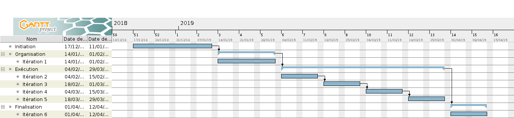

## PM Délais

*S'assurer que les taches sont réalisées dans le bon ordre, et terminée à temps*

... supervise ce domaine de connaissance.

### Définition des échéances

1. Identification des dépendances temporelles (tâche A dépend de tâche B qui dépend de tâche C...)
2. Identification de l'échéance générale
  - Livrables : les échéances sont imposées
  - Produits internes / intermédiaires : les échéances sont estimées en réunion (planning poker, cf. contenu)
3. Échéance supérieur à une semaine -> découpage en sous-tâches, et *goto 1*
4. Les tâches et échéances sont ajoutées au diagramme de Gantt.

*Non confirmé : les principales échéances sont reportées sur un calendrier indiquant les périodes de vacances, examens, etc. de l'UPS.*

### Contrôle et maîtrise des échéances

Le diagramme de Gantt (et l'échéancier) sont consultables à tout moment sur le dépôt git.

Chacun réalisateur de tâche est responsable de la tenue des délais. S'il craint de ne pas honorer l'échéance, il demande de l'aide (à sa propre initiative)

Le découpage des tâches en tâches élémentaires (max 1 semaine) permet de suivre l'avancement lors de TD (vendredis) et des réunions d'itérations (lundis).  
Cela est suffisant pour réduire le risque de retard, et pour permettre de s'en rendre compte rapidement.

### Recueil des exigences

TD / SJQ

- Les échéances des livrables sont respectées, **la date du dépôt (git) faisant foi**.

M. Pellegrini

- ???

Soutenance

 - ???

Fiches d'avancement Interpromo

- Toutes les semaines

### Diagramme de Gantt

### Calendrier UPS / Projet

| Semaine | # iter | lundi | UPS                                   | Projet         |
| :-----: | :----: | :---- | :------------------------------------ | :------------- |
| 50      |        | 10/12 | **Examens**                           |                |
| 51      | 0      | 17/12 |                                       |                |
| 52      |        | 24/12 | *Vacances*                            |                |
| 1       |        | 31/12 | *Vacances*                            |                |
| 2       |        | 07/01 |                                       |                |
| 3       | 1      | 14/01 |                                       |                |
| 4       |        | 21/01 |                                       |                |
| 5       |        | 28/01 |                                       |                |
| 6       | 2      | 04/02 |                                       |                |
| 7       |        | 11/02 |                                       |                |
| 8       | 3      | 18/02 |                                       |                |
| 9       |        | 25/02 | *Vacances*                            |                |
| 10      | 4      | 04/03 |                                       |                |
| 11      |        | 11/03 |                                       |                |
| 12      | 5      | 18/03 | **Exam IDBR**                         |                |
| 13      |        | 25/03 |                                       |                |
| 14      | 6      | 01/04 | **Exam OCA**                          |                |
| 15      |        | 08/04 | **Exams IAA, TIR**                    |                |
| 16      | FIN    | 15/04 | **Exams AIRCR, TAAAS, CESGBDR, Prof** | Soutenance     |
| 17      |        | 22/04 | *Vacances*                            |                |
| 18      |        | 29/04 | *Vacances* ...                        |                |

